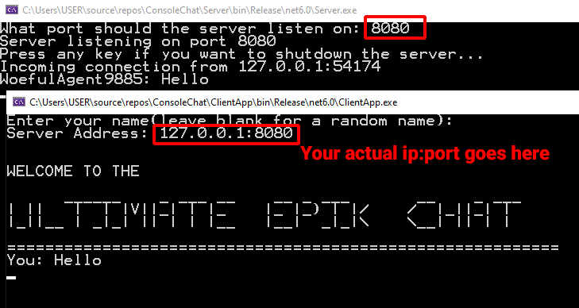

# Ultimate-Epik-Chat

 

<i>"Out of all the chats this is definetly one of them" - Joe</i> 
<i>"10/10 would recommend" - Also Joe</i>

# About
A simple chat app I made to learn about network programming in C#. There are 2 parts to the application the server and the client. Someone will have to host the server and others can join the server using the server address. Functions as a basic global chat.

# How to use
You can use the precompiled binaries in the <a href="https://github.com/Hyrdaboo/Ultimate-Epik-Chat/releases/">releases</a> or if you want to compile the code yourself:  

* Clone this repo
* Download and install <a href="https://dotnet.microsoft.com/en-us/download">.NET 6.0</a> if you haven't
* Run the solution (.sln) file to open it in Visual Studio
* Switch startup project to server or client whichever you want to run  

### Hosting Server
Hosting a server locally is very simple. All you need to do is enter a port number for example 8080 on which the server will listen. Then you can share your machine's ip adress with people who are connected to your LAN and they can enter the server using ip:port format. If you want to connect over the internet that part is a little bit more tricky. You'll have to set up a port forward rule and listen on that specific port. If you managed to do that others can use your public ip with that specific port to connect over internet.  

