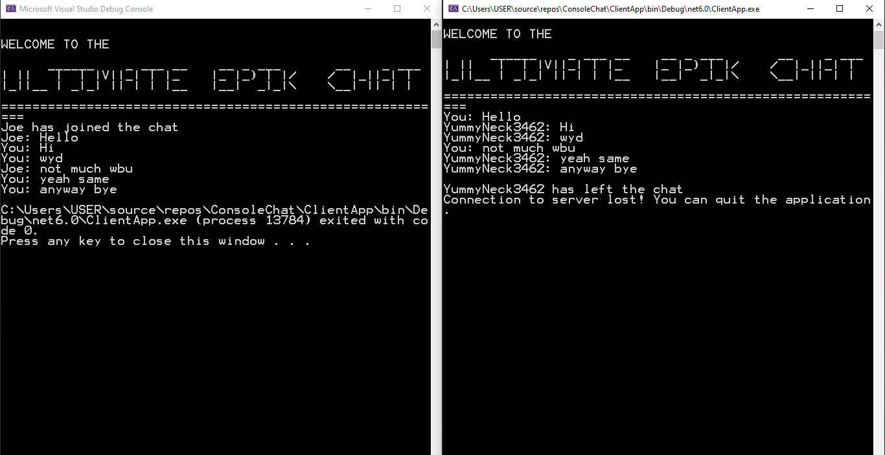
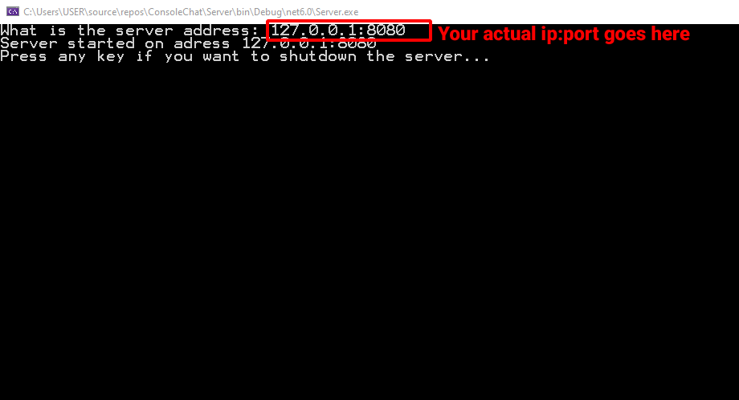

# Ultimate-Epik-Chat

<br>
<p>
<i>"Out of all the chats this is definetly one of them" - Joe</i><br>
<i>"10/10 would recommend" - Also Joe</i>
</p>

# About
A simple chat app I made to learn about network programming in C#. There are 2 parts to the application the server and the client. Someone will have to host the server and others can join the server using the server address. Functions as a basic global chat.

# How to use
You can use the precompiled binaries in the <a href="https://github.com/Hyrdaboo/Ultimate-Epik-Chat/releases/download/v1.0/Build.zip">releases</a> or if you want to compile the code yourself: <br>

* Clone this repo
* Download and install <a href="https://dotnet.microsoft.com/en-us/download">.NET 6.0</a> if you haven't
* Run the solution (.sln) file to open it in Visual Studio
* Switch startup project to server or client whichever you want to run <br>

### Hosting Server
You will need to enter the IP address and port number separated by a colon (:) in the following format: ip:port, for example, ```127.0.0.1:8080```. <br>
Please note that the provided IP address is known as the loopback address. If you want to use the application with your friends, you have two options: connect over LAN or open a port forward rule. To find your local IP address, type ipconfig in the command line, and then copy and paste IPv4 address. In the case of port forwarding, remember to use the specific port you have set a forward rule for. <br><br>
<br>
